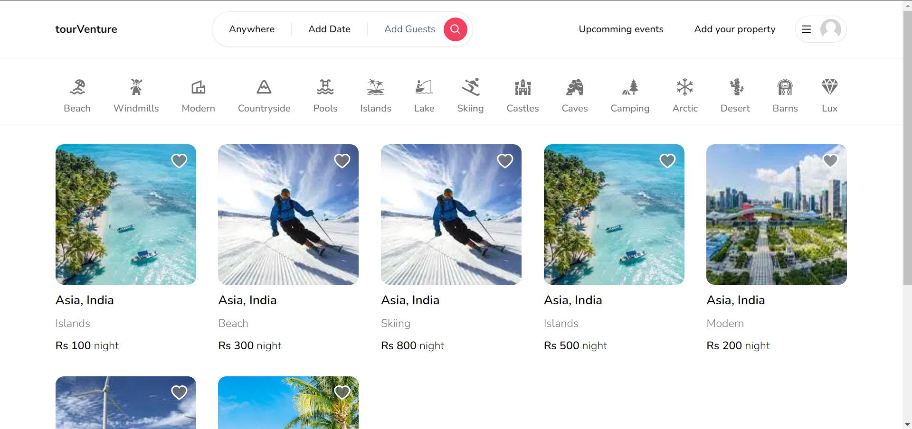
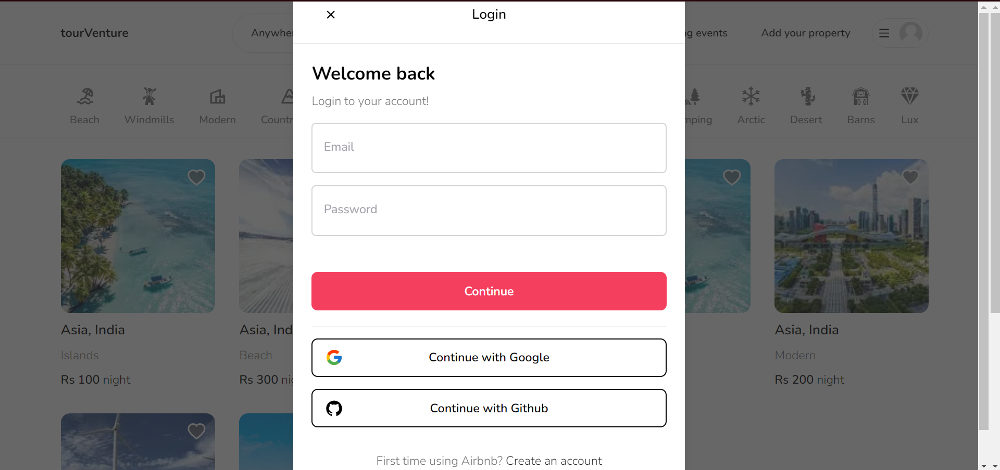
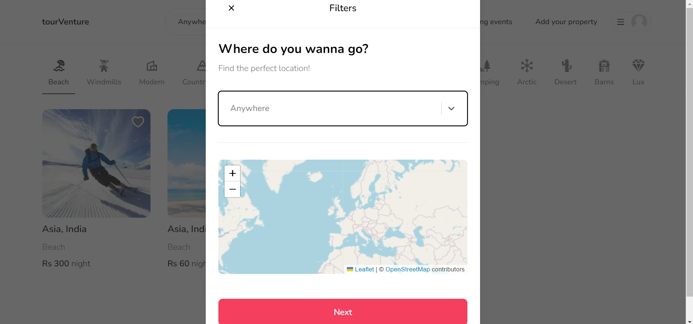

# TourVenture

Welcome to **TourVenture**! Our team, **Radian Roam Ranger (RRR)**, has embarked on a mission to revolutionize the tourism ecosystem. We aim to create a platform that connects travelers with genuine local experiences and services, fosters cultural exchange, and supports tour guides.

## Problem Statement

We have identified a need for a platform that enhances the overall tourism experience by bridging the gap between travelers and local guides. Our solution, **TourVenture**, is a web progressive app designed to address this need with the following key features:

### Key Features

1. **Local Tour Guide Booking**
    - Travelers can book local tour guides who have in-depth knowledge of their area. For example, if you wish to explore Varanasi, a local guide will provide you with a richer cultural experience.

2. **Live Cultural Event Suggestions**
    - Plan your tours around live cultural events. Our system recommends events happening on your chosen dates, ensuring you don't miss out on local festivities.

3. **Personalized Tour Recommendations**
    - Based on your last three tours, our system suggests new cities to explore, tailored to your preferences.

## Visual Samples

Here are some snapshots of our platform in action:

Join us in making travel more enriching and culturally immersive with **TourVenture**!

